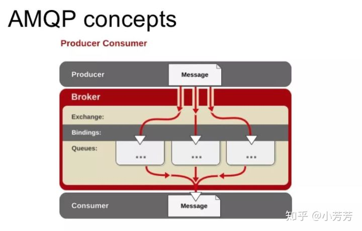
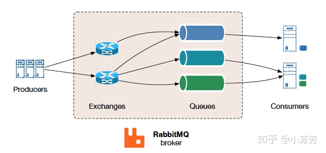

# spring-cloud-stream 体系使用

[singleHtml文档][singleHtml文档]

在本demo中，将使用spring-integration和spring-function，整合这几个部分来完成消息发送

spring-cloud-stream基于EIP（Enterprise Integration Patterns），它是一个开源的消息发送系统，
它提供了一个简单的消息发送系统，它可以将消息发送到任意的消息接收系统。

## OutboundContentTypeConvertingInterceptor与SpringFunction的特别说明

与老版本的spring-cloud-stream不同，从3.0开始，spring-cloud-stream开始拥抱spring-function，使用基于Function，Consumer，Supplier的方式快速注册使用通道

特别需要注意的地方是：

`org.springframework.cloud.stream.binding.MessageConverterConfigurer.configureMessageChannel
`
新版本中代码如下：

```java
// 3.2.3 spring-cloud-stream
		if (this.isNativeEncodingNotSet(producerProperties, consumerProperties, inbound)) {
			if (inbound) {
				messageChannel.addInterceptor(new InboundContentTypeEnhancingInterceptor(contentType));
			}
			else {
				if (environment != null && environment.containsProperty("spring.cloud.stream.rabbit.bindings." + channelName + ".producer.routing-key-expression")) {
					this.setSkipOutputConversionIfNecessary();
					functional = false;
				}
				if (!functional) {
					messageChannel.addInterceptor(new OutboundContentTypeConvertingInterceptor(contentType, this.compositeMessageConverter));
				}
			}
		}
```

老版本中代码如下：

```java
// 2.0.1 spring-cloud-stream
        if (this.isNativeEncodingNotSet(producerProperties, consumerProperties, inbound)) {
            if (inbound) {
                messageChannel.addInterceptor(new MessageConverterConfigurer.InboundContentTypeEnhancingInterceptor(contentType));
            } else {
                messageChannel.addInterceptor(new MessageConverterConfigurer.OutboundContentTypeConvertingInterceptor(contentType, this.compositeMessageConverterFactory.getMessageConverterForAllRegistered()));
            }
        }
```

也就说老版本中，消息产生端默认添加的Outbound消息拦截器OutboundContentTypeConvertingInterceptor不会被添加到新版本中的Outbound中

新版本中添加的条件是，为这个channel添加`spring.cloud.stream.rabbit.bindings." + channelName +
".producer.routing-key-expression"`
属性，这样就可以让消息产生端添加Outbound消息拦截器OutboundContentTypeConvertingInterceptor。

为什么OutboundContentTypeConvertingInterceptor如此重要？在spring-cloud-stream中，默认使用的Content-type是application/json，这有利于脱离java体系接受消息。

我们需要根据ContentType来Convert消息，所以需要添加OutboundContentTypeConvertingInterceptor。否则，
没有添加这个消息通道拦截器，我们只能让pojo实现java的序列化接口，
使用`application/x-java-serialized-object`
的格式来传输对象。这在java系统中，是没有特别大的问题。但是显然，我们需要json对象格式使得数据的传输脱离具体的语言依赖。

当使用spring-integration的,通过消息网关发送数据，默认会使用`org.springframework.amqp.support.converter.SimpleMessageConverter.createMessage`
方法，
查看代码易知，要么数据是byte[]，要么数据是String,要么数据实现了序列化接口。否则会抛出不支持的异常。

通过OutboundContentTypeConvertingInterceptor我们提前把数据转成我们想要的byte[],从而脱离其他的设置，保证数据的通用性。

也就是说配置
`spring.cloud.stream.rabbit.bindings." + channelName +
".producer.routing-key-expression"`
成了使用SpringFunction某种意义上的必备的配置（也有解决办法[通用解决方案-舍弃SpEL中提取消息体的功能](#通用解决方案-舍弃SpEL中提取消息体的功能)
），该配置，在spring-cloud-stream-rabbit中说明如下：

> ## routingKeyExpression
> A SpEL expression to determine the routing key to use when publishing messages.
> For a fixed routing key, use a literal expression,
> such as routingKeyExpression='my.routingKey' in a properties file
> or routingKeyExpression: '''my.routingKey''' in a YAML file.

也就是说配置一个`my.routingKey`的key在yml文件中，指定其value为配置的destination。 也可以使用SpEL表达式来实现更加强大和动态的
功能，从而动态的决定destination的位置

为什么要这么改？从提交记录中我们看到其是为了解决issue #2145，对应链接https:
//github.com/spring-cloud/spring-cloud-stream/issues/2145

简单的来说在functional model中，负载payload需要推迟他的转换，否则会造成计算routing-key-expression的SpEL时的异常

更详细的内容提到了issue 83，链接https:
//github.com/spring-cloud/spring-cloud-stream-binder-rabbit/issues/83#issuecomment-810587861

我们看到该issue中提到的问题就是，在使用`routing-key-expression`
时，使用SpEL表达式，比如使用了payload.eventType。也就是获取消息体中的eventType字段。
此时会出现异常:

> Exception:
> Caused by: org.springframework.expression.spel.SpelEvaluationException: EL1008E: Property or
> field 'eventType' cannot be found on object of type 'byte[]' - maybe not public?

的确，在配套spring function编程模型时，想要使用SpEL的话，就不能过早的将pojo转成byte[]
，否则就无法获取到消息体payload内部的属性和值，所以就增加了上述的if条件判断。如果包含了那个key，就不会添加通道拦截来转换pojo。

在issue中同样我们看到在没有做修复之前，[garyrussell](https://github.com/garyrussell)
建议使用`spring.cloud.stream.rabbit.bindings.requestChannel.producer.routing-key-expression=headers.eventType`
用请求头的值来使用SpEL计算。

## Drop Failed Messages 删除失败的消息

By default, if no additional system-level configuration is provided, the messaging system drops the
failed message. While acceptable in some cases, for most cases, it is not, and we need some recovery
mechanism to avoid message loss.

默认情况下，如果没有提供额外的系统级配置，消息传递系统将删除失败的消息。虽然在某些情况下可以接受，但在大多数情况下不可以，我们需要一些恢复机制来避免消息丢失。

### DLQ - Dead Letter Queue 死信队列

使用死信队列的时候必须指定消费者的`group`属性。通过设置`auto-bind-dlq`来将失败的消息发送到死信队列。

比如声明的配置是这样的：

```java
@SpringBootApplication
public class SimpleStreamApplication {

	public static void main(String[] args) throws Exception {
		SpringApplication.run(SimpleStreamApplication.class,
		  "--spring.cloud.function.definition=uppercase",
		  "--spring.cloud.stream.bindings.uppercase-in-0.destination=uppercase",
		  "--spring.cloud.stream.bindings.uppercase-in-0.group=myGroup",
		  "--spring.cloud.stream.rabbit.bindings.uppercase-in-0.consumer.auto-bind-dlq=true"
		);
	}

	@Bean
	public Function<Person, Person> uppercase() {
		return personIn -> {
		   throw new RuntimeException("intentional");
	    };
	};
}

```

那么对于rabbit而言`uppercase.myGroup.dlq`这样的额外的死信队列就会被创建。

可以通过指定重试次数为1，让失败的消息立即发送到死信队列：

```text
--spring.cloud.stream.bindings.uppercase-in-0.consumer.max-attempts=1
```

可以通过配置template来定制更多的重试属性

```java
@StreamRetryTemplate
public RetryTemplate myRetryTemplate() {
    return new RetryTemplate();
}
```

### exchangeType

rabbitmq默认使用topic作为exchangeType。The exchange type: direct, fanout, headers or topic for
non-partitioned
destinations and direct, headers or topic for partitioned destinations.

### deadLetterExchangeType

使用的是`direct`作为默认的deadLetterExchangeType

## rabbitmq 基础知识

amqp概览如下  


* Producer：消息生产者，即投递消息的程序。
* Broker：消息队列服务器实体。
    * Exchange：消息交换机，它指定消息按什么规则，路由到哪个队列。
    * Binding：绑定，它的作用就是把 Exchange 和 Queue 按照路由规则绑定起来。
    * Queue：消息队列载体，每个消息都会被投入到一个或多个队列。
* Consumer：消息消费者，即接受消息的程序。

[知乎专栏AMQP介绍][知乎专栏AMQP介绍]



如图，生产者直面Exchange交换机，交换机通过特定策略把消息放到队列中，而消费者，从队列接受数据，从左到右，分层解耦


[知乎专栏AMQP介绍]: https://zhuanlan.zhihu.com/p/37198933

[singleHtml文档]: https://docs.spring.io/spring-cloud-stream/docs/Brooklyn.RELEASE/reference/htmlsingle/